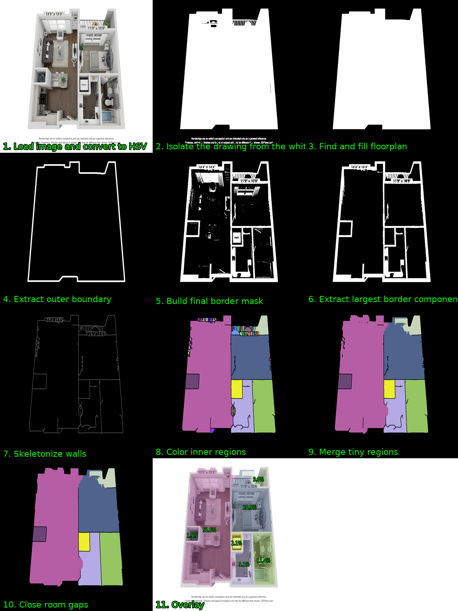
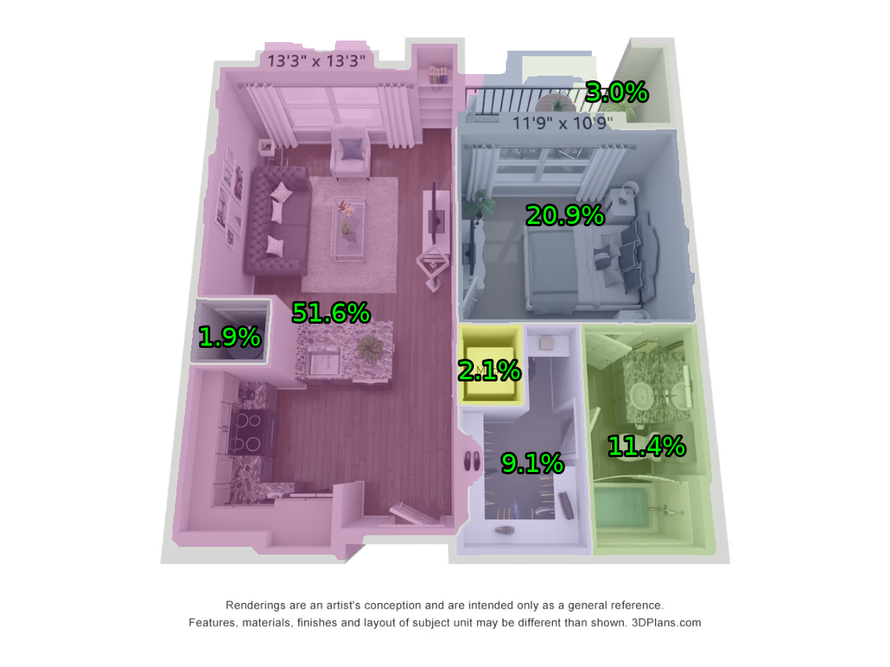
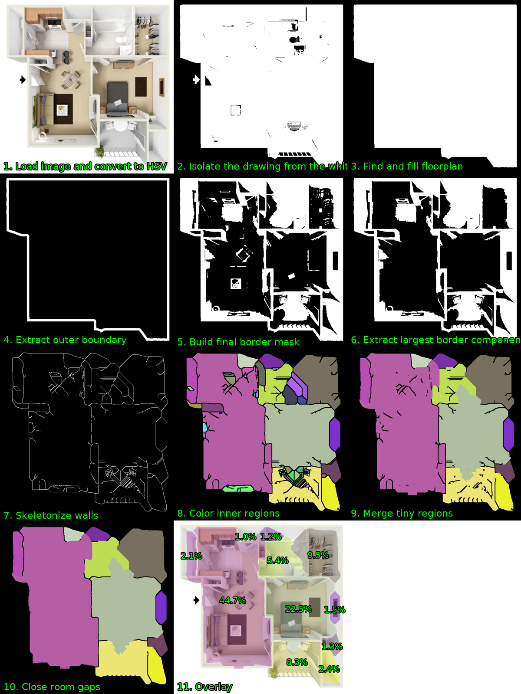
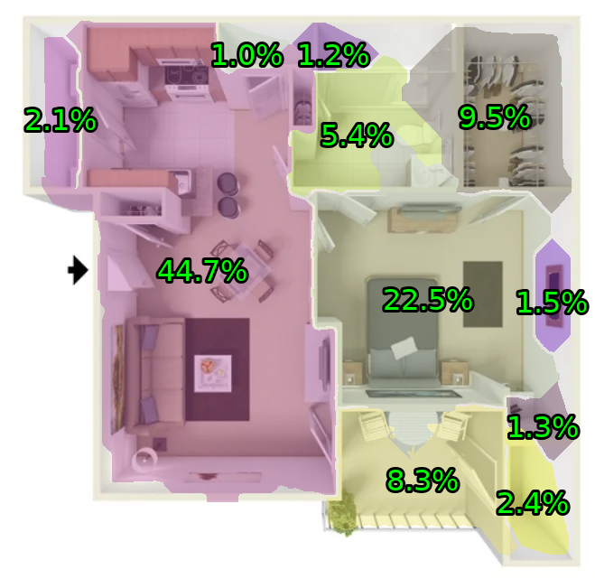
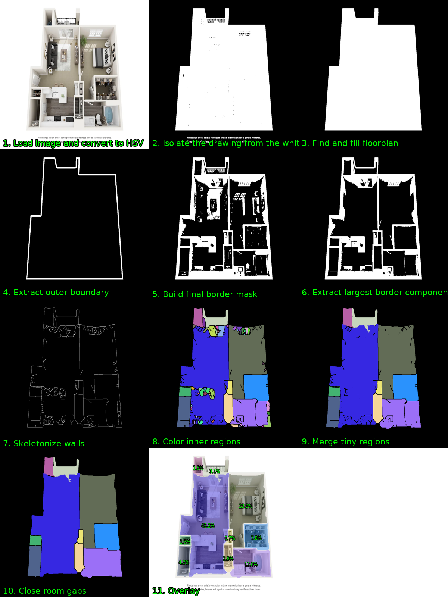
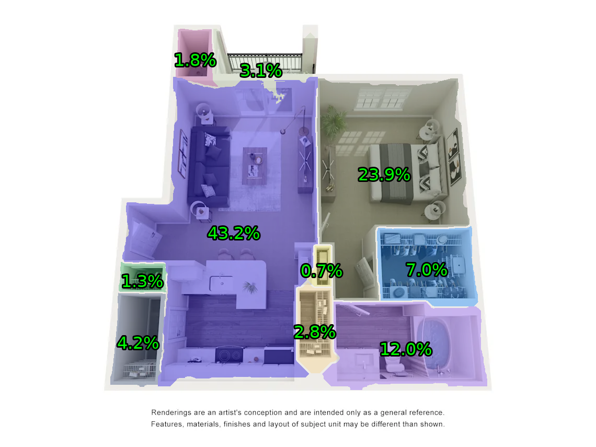

# Floorplan Room Segmentation

## Results

| Pipeline | Overlay |
| --- | --- |
|  |  |
|  |  |
|  |  |


## Setup

```bash
python -m pip install -r requirements.txt
```

## Run

```bash
python main.py
```


## Pipeline Steps

1. Load image and convert to HSV: read the source image and split color into hue, saturation, and value.
2. Isolate the drawing from the white background: keep pixels that look like floorplan content.
3. Find and fill floorplan: keep the biggest connected drawing region and fill holes inside it.
4. Extract outer boundary: erode the floorplan and subtract it to get the outside edge.
5. Build final border mask: combine light interior wall pixels with the outside edge.
6. Extract largest border component: keep the main connected wall/border structure.
7. Skeletonize walls: convert thick borders into single-pixel wall lines.
8. Color inner regions: label open spaces inside the wall lines and color them for debugging.
9. Merge tiny regions: merge small accidental regions into nearby large rooms.
10. Close room gaps: fill small holes and gaps inside each room.
11. Overlay: draw final rooms and relative pixel-based area labels on the original image.

## Outputs

`pipeline.png` shows each intermediate step.

`overlay.png` shows the final rooms with relative area labels.

`rooms.json` contains each room index, pixel area, relative area, center point, and polygon.

## Possible next steps

1. Extend the borders of the exterior rooms to fit the boundary from the step 4.
2. Classify all skeleton lines into two classes: horizontal and vertical.
3. Flatten the skeleton lines.
4. Approximate the room polygon with smaller number of points. Make the rooms to be more rectangular.
